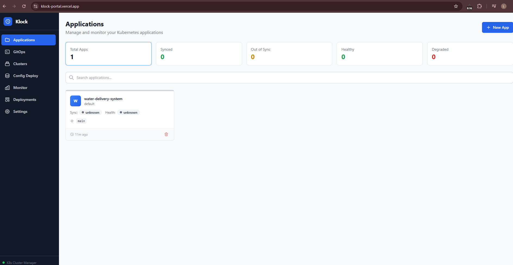
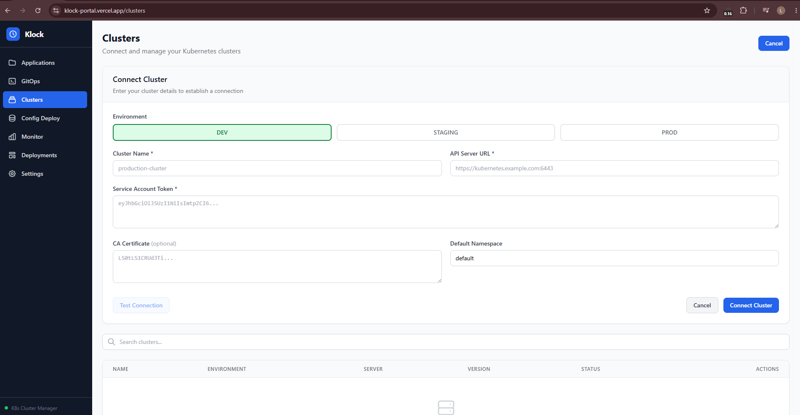
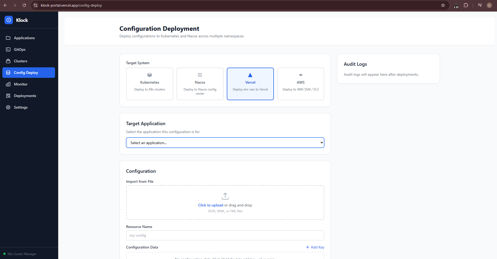
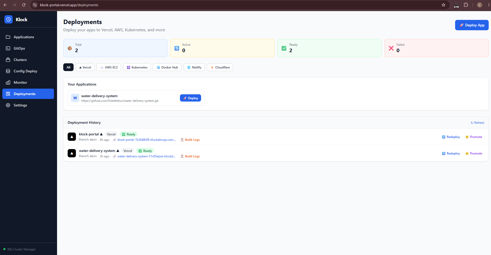
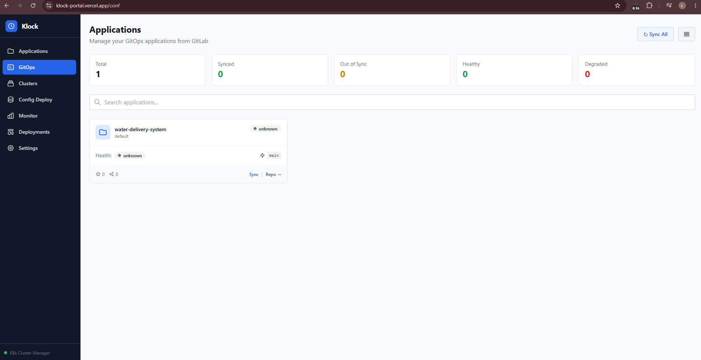

# Klock Portal

A Kubernetes cluster management portal — manage K8s clusters, deployments, ConfigMaps, Secrets, and RBAC manifests from a single web interface.

**Live:** [klock-portal.vercel.app](https://klock-portal.vercel.app/)

---

## Screenshots

| Dashboard | Clusters | Config Deploy | Deployment | GitOps |
|-----------|----------|---------------|------------|--------|
|  |  |  |  |  |

---

## Features

- **Cluster Registration** — register and validate K8s clusters with live connectivity checks
- **Dashboard** — resource overview with charts (namespaces, deployments, configmaps, secrets)
- **Deployment Management** — list, filter, and trigger rollouts across namespaces
- **ConfigMaps & Secrets** — create, edit, and delete K8s ConfigMaps and Secrets from the UI
- **RBAC Manifest Generator** — generate ServiceAccount, Role, and RoleBinding YAML
- **GitOps Sync** — commit manifests to Git and trigger ArgoCD sync in one step
- **Nacos Integration** — push/pull configuration from a Nacos config center
- **Monitoring** — Grafana dashboard links and cluster health status
- **Supabase Auth** — email/password login with protected routes

---

## Tech Stack

| Layer | Technology |
|-------|------------|
| Frontend | React 19, Vite, React Router v7, Tailwind CSS |
| Charts | Recharts |
| Forms | React Hook Form |
| Backend | Python FastAPI |
| Database | Supabase (PostgreSQL + Row-Level Security) |
| Auth | Supabase Auth |
| GitOps | ArgoCD |
| Config Center | Nacos |
| Monitoring | Grafana |
| Containerization | Docker, Docker Compose |

---

## Getting Started

### Prerequisites

- Node.js >= 22
- Python >= 3.12
- A [Supabase](https://supabase.com) project (free tier works)

### 1. Clone & install

```bash
git clone https://github.com/linletlettun/Klock.git
cd Klock
npm install
```

### 2. Environment variables

Copy the example and fill in your Supabase credentials:

```bash
cp .env.example .env
```

```env
VITE_SUPABASE_URL=https://your-project.supabase.co
VITE_SUPABASE_ANON_KEY=your-anon-key
```

For the backend:

```bash
cd backend
cp .env.example .env
# fill SUPABASE_URL, SUPABASE_KEY, etc.
```

### 3. Run

```bash
# Frontend (Vite dev server)
npm run dev

# Backend (FastAPI)
cd backend
pip install -r requirements.txt
uvicorn main:app --reload --port 8000
```

Or with Docker Compose:

```bash
docker compose up
```

Frontend: `http://localhost:3000` · Backend API: `http://localhost:8000`

---

## Project Structure

```
Klock/
├── src/
│   ├── components/
│   │   ├── clusters/      # ClusterCard, AddClusterForm
│   │   ├── configmaps/    # ConfigMapEditor
│   │   ├── deployments/   # DeploymentList, RolloutTrigger
│   │   ├── secrets/       # SecretEditor
│   │   ├── pods/          # Pod management
│   │   ├── layout/        # Navbar, Sidebar, ProtectedRoute
│   │   └── ui/            # Button, Modal, Toast
│   ├── pages/             # Dashboard, Clusters, Deployments, Monitor, Settings
│   ├── hooks/             # useClusters, useDeployments
│   ├── lib/supabase.js    # Supabase client
│   └── store/             # ClusterContext, AuthContext
├── backend/
│   ├── main.py            # FastAPI entry point
│   ├── routers/           # cluster, configmaps, secrets, argocd, gitops, nacos...
│   ├── services/          # Business logic
│   └── models/            # Pydantic schemas
├── .claude/
│   ├── agents/            # k8s-agent, frontend-agent, db-agent
│   └── skills/            # k8s-manifests, cluster-connect, config-deploy, auth-guard
├── docker-compose.yml
└── CLAUDE.md              # Claude Code development guide
```

---

## API Endpoints

| Endpoint | Method | Description |
|----------|--------|-------------|
| `/api/cluster` | GET / POST | List / create clusters |
| `/api/cluster/{id}` | GET / PUT / DELETE | Cluster CRUD |
| `/api/cluster/test-connection` | POST | Test K8s API connectivity |
| `/api/clusters/{id}/namespaces` | GET | List namespaces |
| `/api/clusters/{id}/configmaps` | GET / POST | ConfigMaps |
| `/api/clusters/{id}/secrets` | GET / POST | Secrets |
| `/api/gitops/sync` | POST | Git commit + ArgoCD sync |
| `/api/argocd/applications` | GET | List ArgoCD applications |
| `/api/argocd/applications/{name}/sync` | POST | Sync an ArgoCD app |
| `/api/nacos/configs` | GET / POST | Nacos config management |
| `/api/settings` | GET / PUT | App settings (tokens masked) |
| `/health` | GET | Health check |

---

## Claude Code Integration

Klock is built with [Claude Code](https://claude.com/claude-code) — the repo includes custom agents and skills for AI-assisted development.

### Agents

| Agent | Purpose |
|-------|---------|
| `k8s-agent` | K8s API calls, manifest generation, RBAC |
| `frontend-agent` | React components, pages, routing |
| `db-agent` | Supabase queries, database hooks |

### Skills

| Skill | When to use |
|-------|-------------|
| `k8s-manifests` | Generate Kubernetes YAML manifests |
| `cluster-connect` | Register & validate cluster connectivity |
| `config-deploy` | Deploy ConfigMaps and Secrets to clusters |
| `auth-guard` | Set up protected routes and session handling |

### MCP Servers

| Server | Purpose |
|--------|---------|
| Supabase | Direct database operations |
| ArgoCD | App management, sync, rollback |
| Puppeteer | Browser screenshots & automation |

---

## License

[MIT](LICENSE)
